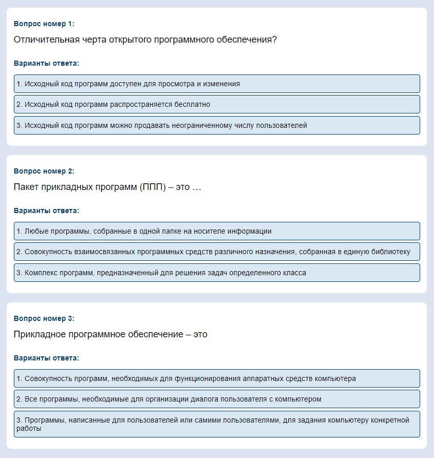

# Задание

Создать xml файл валидной разметки с вложенностью не менее трёх уровней. Количество различных элементов второго уровня должно быть не менее двух. Количество различных элементов третьего уровня должно быть не менее четырёх. Тематика xml файла произвольная. Для каждого элемента первого уровня предусмотреть не менее 3 экземпляров, для каждого элемента последующих уровней – не менее двух экземпляров. Привязать к XML файлу файл разметки CSS. Каждый элемент третьего уровня должен обладать своим стилем. Можно указывать цвет и фон текста, размер и стиль написания, шрифты, отступы и т.п.

# Порядок выполнения работы
## Напишем содержимое xml документа

```xml
<?xml version="1.0" encoding="UTF-8"?>
<?xml-stylesheet href="styles.css" type="text/css"?>
<test-system>

    <question>
        <question-details>
            <question-number>Вопрос номер 1:</question-number>
            <question-text>Отличительная черта открытого программного обеспечения?</question-text>
        </question-details>
        <answers>
            <answer-title>Варианты ответа: </answer-title>
            <answer-variant>1. Исходный код программ доступен для просмотра и изменения</answer-variant>
            <answer-variant>2. Исходный код программ распространяется бесплатно</answer-variant>
            <answer-variant>3. Исходный код программ можно продавать неограниченному числу пользователей</answer-variant>
        </answers>
    </question>

     <question>
        <question-details>
            <question-number>Вопрос номер 2:</question-number>
            <question-text>Пакет прикладных программ (ППП) – это …</question-text>
        </question-details>
        <answers>
            <answer-title>Варианты ответа: </answer-title>
            <answer-variant>1. Любые программы, собранные в одной папке на носителе информации</answer-variant>
            <answer-variant>2. Совокупность взаимосвязанных программных средств различного назначения, собранная в единую библиотеку</answer-variant>
            <answer-variant>3. Комплекс программ, предназначенный для решения задач определенного класса</answer-variant>
        </answers>
    </question>

     <question>
        <question-details>
            <question-number>Вопрос номер 3:</question-number>
            <question-text>Прикладное программное обеспечение – это</question-text>
        </question-details>
        <answers>
            <answer-title>Варианты ответа: </answer-title>
            <answer-variant>1. Совокупность программ, необходимых для функционирования аппаратных средств компьютера</answer-variant>
            <answer-variant>2. Все программы, необходимые для организации диалога пользователя с компьютером</answer-variant>
            <answer-variant>3. Программы, написанные для пользователей или самими пользователями, для задания компьютеру конкретной работы</answer-variant>
        </answers>
    </question>
</test-system>
```

## Реализуем css
```css
test-system {
    background-color: #dee3f1;
}

question {
    border-radius: 10px;
    display: flex;
    flex-direction: column;
    background-color: white;
    margin: 20px;
    padding: 25px 15px 20px 15px;
}

question-number {
    display: flex;
    font-family: Arial, Helvetica, sans-serif;
    color: #003B71;
    font-weight: bold;
    font-size: 16px;
    margin-bottom: 15px;
}

question-text {
    display: flex;
    font-family: Arial, Helvetica, sans-serif;
    color: black;
    font-size: 20px;
    margin-bottom: 25px;
}

answers {
    display: flex;
    flex-direction: column;
    background-color: white;
}

answer-title {
    display: flex;
    font-family: Arial, Helvetica, sans-serif;
    color: #003B71;
    font-weight: bold;
    font-size: 16px;
    margin-top: 5px;
    margin-bottom: 15px;
}

answer-variant{
    display: flex;
    border: solid 1px #003B71;
    border-radius: 5px;
    font-family: Arial, Helvetica, sans-serif;
    font-weight: regular;
    font-size: 16px;
    margin-bottom: 5px;
    background-color: #DAE8F4;
    padding:10px 5px 10px 5px;
}

answer-variant:hover{
    display: flex;
    background-color: #003B71;
    color: #DAE8F4;
}
```

## Пример реализации
