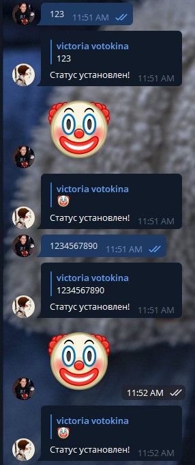

# Задание
Принять текстовое сообщение от собеседника бота. Отправить его в социальную сеть вконтакте. Варианты: Поставить в статус

# Порядок выполнения работы

## Код файла *.py
```python
import telebot
import requests

TOKEN = 'TOKEN'
VK_TOKEN = 'VK_TOKEN'

bot = telebot.TeleBot(TOKEN)

@bot.message_handler(commands=['start'])
def start(message):
    bot.send_message(message.chat.id, 'Введите текст для установки статуса')

@bot.message_handler(content_types=["text"])
def text_message(message):
    if setStatus(message.text):
        bot.reply_to(message, "Статус установлен!")
    else:
        bot.reply_to(message, "Не удается установить статус.")

def setStatus(text):
    res = requests.get('https://api.vk.com/method/status.set?access_token=' + VK_TOKEN + "&text=" + text + "&v=5.131")
    return res

bot.polling(none_stop=True)
```


## Скриншоты работающей программы
