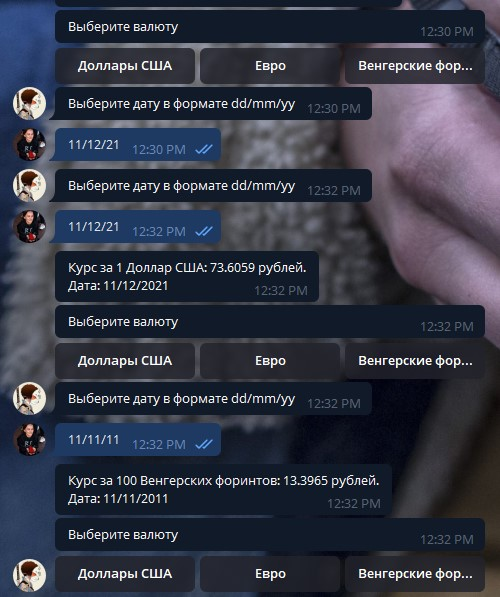

# Задание
Телеграм бот должен выдавать курс валюты по отношению к рублю. Валюта
выбирается преподавателем. Дата вводится пользователем с клавиатуры.
## Дополнительное задание
Бот должен иметь клавиатуру с выбором из не менее чем 2 разных валют

# Порядок выполнения работы

## Код файла *.py
```python
from datetime import datetime
import xml.dom.minidom
from numpy import number
import requests
import telebot
from telebot import types
from enum import Enum

TOKEN = 'TOKEN'
bot = telebot.TeleBot(TOKEN)

class ChatState(Enum):
    INITIAL = 0
    VALUTE_INPUT = 1

chat_state = ChatState.INITIAL
valute_code = ""

@bot.message_handler(commands=['start'])
def send_valute_keyboard(message):

    keyboard = types.InlineKeyboardMarkup()
    keyboard.row(*[types.InlineKeyboardButton(text="Доллары США", callback_data="R01235"), 
                   types.InlineKeyboardButton(text="Евро", callback_data="R01239"),
                   types.InlineKeyboardButton(text="Венгерские форинты", callback_data="R01135")])

    bot.send_message(message.chat.id, "Выберите валюту", reply_markup=keyboard)

@bot.callback_query_handler(func=lambda update: update.data)
def send_new_state(update):
    global chat_state
    global valute_code

    chat_state = ChatState.VALUTE_INPUT
    valute_code = update.data
    bot.send_message(update.message.chat.id, "Выберите дату в формате dd/mm/yy")

@bot.message_handler(content_types=['text'])
def date_input(message):
    global chat_state
    global valute_code

    if chat_state == ChatState.VALUTE_INPUT:
        
        try:
            date = datetime.strptime(message.text, "%d/%m/%y")
            
            result = ""
            day = str(date.day)
            month = str(date.month)

            if (len(day) == 1):
                day = '0' + day

            if (len(month) == 1):
                month = '0' + month

            date_query = day + "/" + month + "/" + str(date.year)
            response = requests.get("http://www.cbr.ru/scripts/XML_daily.asp?date_req=" + date_query)
            dom = xml.dom.minidom.parseString(response.text)
            dom.normalize()

            valutes = dom.getElementsByTagName("Valute")

            for valute in valutes:
                if valute.getAttribute("ID") == valute_code:
                    new_value = float(valute.getElementsByTagName("Value")[0].childNodes[0].nodeValue.replace(',','.'))
                    name = str(valute.getElementsByTagName("Name")[0].childNodes[0].nodeValue.replace(',','.'))
                    nominal = float(valute.getElementsByTagName("Nominal")[0].childNodes[0].nodeValue.replace(',','.'))
                    result = result + "Курс за " + str(round(nominal)) + " " + str(name) + ": " + str(new_value) + " рублей. \n" + "Дата: " + date_query

            bot.send_message(message.chat.id, result)

            chat_state = ChatState.INITIAL
            valute_code = ""
            send_valute_keyboard(message)

        except ValueError as e:
            print(str(e))
            bot.send_message(message.chat.id, "Дата указано некорректно. Правильный формат: dd/mm/yyyy")


bot.infinity_polling()
```


## Скриншоты работающей программы
