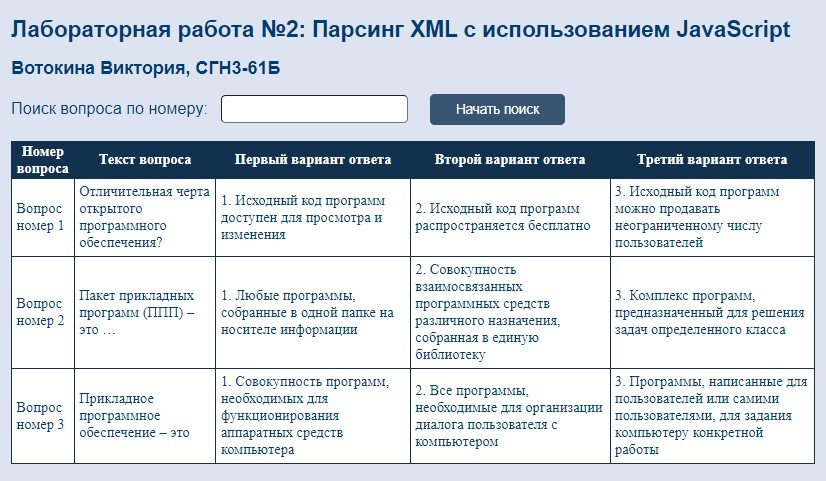

# Задание
Создать HTML страницу с встроенным скриптом, который будет обрабатывать выданный вам XML файл. Вам необходимо вывести на экран все элементы третьего, последнего уровня вложенности одного из элементов второго уровня. 
# Дополнительное задание 
В HTML файле создать поле ввода, в которое вводиться номер элемента второго уровня, для которого выведутся элементы третьего уровня.

# Порядок выполнения работы
## Код файла html
```html
<!DOCTYPE html>
<html lang="en">
<head>
    <meta charset="UTF-8">
    <meta http-equiv="X-UA-Compatible" content="IE=edge">
    <meta name="viewport" content="width=device-width, initial-scale=1.0">
    <link href="styles.css" rel="stylesheet" type="text/css">
    <title>Парсинг вопросов</title>
    <icon>
</head>
<body>
    <script src="./index.js"></script>
    <h1>Лабораторная работа №2: Парсинг XML с использованием JavaScript</h1>
    <h2>Вотокина Виктория, СГН3-61Б</h2>
    <label for="request-input">Поиск вопроса по номеру:</label>
    <input type="text" id="request-input">
    <button id="get-student-button" onclick="getRequestButtonClicked()">Начать поиск</button>
    <table id="requests-table">
        <thead>
            <tr>
                <th>Номер вопроса</th>
                <th>Текст вопроса</th>
                <th>Первый вариант ответа</th>
                <th>Второй вариант ответа</th>
                <th>Третий вариант ответа</th>
            </tr>
        </thead>
        <tbody>

        </tbody>
    </table>
</body>
</html>
```

## Код файла сss
```css
body {
    background-color:#dee3f1;
    margin: 20px;
}

h1 {
   color: #003B71;
   font-family: Arial, Helvetica, sans-serif;
   font-weight: bold;
   font-size: 25px;
}

h2 {
   color:#003B71;
   font-family: Arial, Helvetica, sans-serif;
   font-size: 20px;
}

table {
    background-color: #11314e;
    color: white;
}
   
td {
    background-color: white;
    color:#003B71;
    padding: 5px;
}

label {
    color: #003B71;
    font-family: Arial, Helvetica, sans-serif;
    font-size: 18px;
    margin-bottom: 20px;
}

input{
    color: #003B71;
    font-family: Arial, Helvetica, sans-serif;
    font-size: 16px;
    border-radius: 5px;
    margin-bottom: 20px;
    margin-left: 10px;
    margin-right: 20px;
    padding: 5px;
}

button {
    font-family: Arial, Helvetica, sans-serif;
    border: 0px;
    font-size: 15px;
    border-radius: 5px;
    color: #ffffff;
    background-color: #375572;
    height: 34px;
    width: 150px;
}

button:active {
    font-family: Arial, Helvetica, sans-serif;
    border: 0px;
    font-size: 15px;
    border-radius: 5px;
    color: #ffffff;
    background-color: #11314e;
    height: 34px;
    width: 150px;
}
```

##     Код файла xml
```xml
<?xml version="1.0" encoding="UTF-8"?>
<test-system>
    <question>
        <question-details>
            <question-number>Вопрос номер 1</question-number>
            <question-text>Отличительная черта открытого программного обеспечения?</question-text>
        </question-details>
        <answers>
            <answer-title>Варианты ответа: </answer-title>
            <answer-variant-1>1. Исходный код программ доступен для просмотра и изменения</answer-variant-1>
            <answer-variant-2>2. Исходный код программ распространяется бесплатно</answer-variant-2>
            <answer-variant-3>3. Исходный код программ можно продавать неограниченному числу пользователей</answer-variant-3>
        </answers>
    </question>

     <question>
        <question-details>
            <question-number>Вопрос номер 2</question-number>
            <question-text>Пакет прикладных программ (ППП) – это …</question-text>
        </question-details>
        <answers>
            <answer-title>Варианты ответа: </answer-title>
            <answer-variant-1>1. Любые программы, собранные в одной папке на носителе информации</answer-variant-1>
            <answer-variant-2>2. Совокупность взаимосвязанных программных средств различного назначения, собранная в единую библиотеку</answer-variant-2>
            <answer-variant-3>3. Комплекс программ, предназначенный для решения задач определенного класса</answer-variant-3>
        </answers>
    </question>

     <question>
        <question-details>
            <question-number>Вопрос номер 3</question-number>
            <question-text>Прикладное программное обеспечение – это</question-text>
        </question-details>
        <answers>
            <answer-title>Варианты ответа: </answer-title>
            <answer-variant-1>1. Совокупность программ, необходимых для функционирования аппаратных средств компьютера</answer-variant-1>
            <answer-variant-2>2. Все программы, необходимые для организации диалога пользователя с компьютером</answer-variant-2>
            <answer-variant-3>3. Программы, написанные для пользователей или самими пользователями, для задания компьютеру конкретной работы</answer-variant-3>
        </answers>
    </question>
</test-system>
```

## Код файла JS
```js
const QUESTION_ROWS = ["question-number", "question-text"];
const ANSWER_ROWS = [ "answer-variant-1", "answer-variant-2", "answer-variant-3"];

function loadRequests() {
    const xhr = new XMLHttpRequest();
    xhr.open('GET', 'TestSystem.xml', false);
    xhr.send();
    return xhr.responseXML;
}

function addRequest(data, requestNumber) {
    const requests = data.getElementsByTagName('question');

    const tableBody = document.getElementById('requests-table').getElementsByTagName('tbody')[0];
    const tableRow = document.createElement('tr');

    const request = requests[requestNumber - 1];
    const user = request.getElementsByTagName("question-details")[0];
    const requestDetails = request.getElementsByTagName("answers")[0];

    QUESTION_ROWS.forEach(tagName => {
        const td = document.createElement('td');
        td.innerHTML = user.getElementsByTagName(tagName)[0].innerHTML;
        tableRow.appendChild(td);
    });

    ANSWER_ROWS.forEach(tagName => {
        const td = document.createElement('td');
        td.innerHTML = requestDetails.getElementsByTagName(tagName)[0].innerHTML;
        console.log(td.innerHTML);
        tableRow.appendChild(td);
    })

    tableBody.appendChild(tableRow);
}

function addAllRequests(data) {
    const requestsAmount = data.getElementsByTagName('question').length;

    for(var i = 0; i < requestsAmount; i++)
        addRequest(xmlData, i + 1);
}

function clearTableBody() {
    const tableBody = document.getElementById('requests-table').getElementsByTagName('tbody')[0];
    tableBody.innerHTML = '';
}

function getRequestButtonClicked() {
    const requestsAmount = xmlData.getElementsByTagName('question').length;
    const requestNum = Number(document.getElementById('request-input').value);

    clearTableBody();

    if (requestNum == 0)
        addAllRequests(xmlData);
    else
        addRequest(xmlData, requestNum);
    
}

const xmlData = loadRequests();
```

## Скриншоты работающей программы
