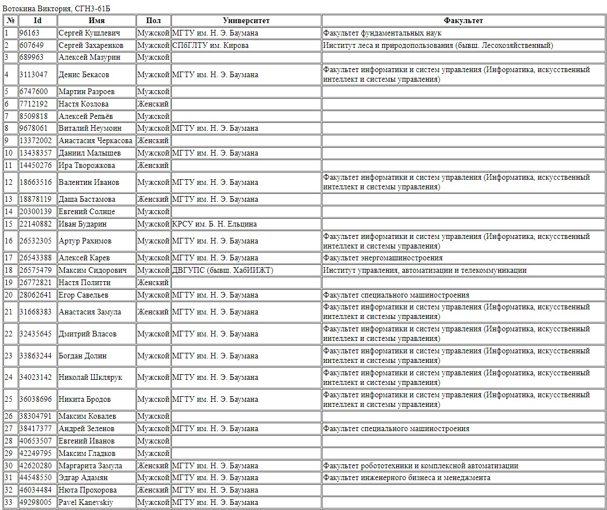

# Задание
Создать HTML страницу с вложенным javascript, который бы выдавал список ID ваших друзей вконтакте. Для каждого друга необходимо вывести дополнительную информацию, согласно варианту.
# Дополнительное задание 
Оформить возвращенный JSON в виде таблицы HTML.

# Порядок выполнения работы
## Код файла html
```html
<!DOCTYPE html>
<html>
<head>
    <script src="https://code.jquery.com/jquery-3.3.1.min.js"></script>
    <script src="./index.js"></script>
    <title>VK API Friends</title>
</head>
<body>
    Вотокина Виктория, СГН3-61Б<br>
    <table id="friends-table" border="1px">
        <thead>
            <tr>
                <th>№</th>
                <th>Id</th>
                <th>Имя</th>
                <th>Пол</th>
                <th>Университет</th>
                <th>Факультет</th>
            </tr>
        </thead>
        <tbody>

        </tbody>
    </table>
    <div border="1px">
</body>

</html>
```

## Код файла js
```css
const ACCESS_TOKEN = "TOKEN";
const REQUEST_URL = 'https://api.vk.com/method/friends.get?access_token=' + ACCESS_TOKEN + '&v=5.131&fields=nickname,sex,education';

$.getJSON({
    url: REQUEST_URL,
    jsonp: "callback",
    dataType: "jsonp"
}).done(function(data) {
    console.log(data);
    fillTable(data.response.items);
});

function fillTable(data) {
    const tableBody = document.getElementById('friends-table').getElementsByTagName('tbody')[0];

    for(var i = 0; i < data.length; i++) {
        const e = data[i];
        const tableRow = document.createElement('tr');
        
        var tableData = document.createElement('td');
        tableData.innerHTML = i + 1;
        tableRow.appendChild(tableData);

        tableData = document.createElement('td'); 
        tableData.innerHTML = e.id;
        tableRow.appendChild(tableData);

        tableData = document.createElement('td');
        tableData.innerHTML = e.first_name + ' ' + e.last_name;
        tableRow.appendChild(tableData);

        tableData = document.createElement('td');
        tableData.innerHTML = e.sex == 1 ? "Женский" : "Мужской";
        tableRow.appendChild(tableData);

        tableData = document.createElement('td');
        tableData.innerHTML = e.university_name ?? "";
        tableRow.appendChild(tableData);

        tableData = document.createElement('td');
        tableData.innerHTML = e.faculty_name ?? "";
        tableRow.appendChild(tableData);      

        tableBody.appendChild(tableRow);
    }
}
```


## Скриншоты работающей программы
