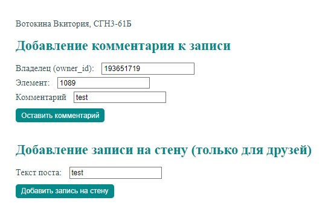

# Задание
Создать HTML страницу с встроенным скриптом, который будет в зависимости от варианта выполнять следующие действия: Оставлять пост на стене с видимостью только для друзей, оставлять комментарий под постом.

# Дополнительное задание 
В специальном поле можно указать id аккаунта, которому вы хотите отправить
сообщение или пост.
# Порядок выполнения работы
## Код файла html
```html
<!DOCTYPE html>
<html>
<head>
    <link href="styles.css" rel="stylesheet" type="text/css">
    <script src="https://code.jquery.com/jquery-3.3.1.min.js"></script>
    <script src="index.js"></script>
    <title>VK API Wall</title>
</head>
<body>
    Вотокина Вкитория, СГН3-61Б<br>
    
    <h1>Добавление комментария к записи</h1>
    Владелец (owner_id):
    <input type="text" id="owner_id" value="193651719"><br>
    Элемент:
    <input type="text" id="post_id" value="1089"><br>
    Комментарий
    <input type="text" id="message" value="test"><br>
    <button id="AddComment" onclick="AddCommentClicked()">Оставить комментарий</button><br>

    <h1>Добавление записи на стену (только для друзей)</h1>
    Текст поста:
    <input type="text" id="post" value="test"><br>
    <button id="AddPost" onclick="AddPostClicked()">Добавить запись на стену</button>
    
</body>

</html>
```

## Код файла js
```css
const ACCESS_TOKEN = "TOKEN";

function AddCommentClicked() {
    const ownerId = document.getElementById('owner_id').value;
    const postId = document.getElementById('post_id').value;
    const message = document.getElementById('message').value;

    const requestUrl = 'https://api.vk.com/method/wall.createComment?access_token=' + ACCESS_TOKEN + '&v=5.131&owner_id=' + ownerId + '&post_id=' + postId + '&message=' + message;

    sendRequest(requestUrl);
}  

function AddPostClicked() {
    const post = document.getElementById('post').value;
    
    const requestUrl = 'https://api.vk.com/method/wall.post?access_token=' + ACCESS_TOKEN + '&v=5.131&friends_only=1&message=' + post;
    
    sendRequest(requestUrl);
}  

function sendRequest(requestUrl) {
    console.log(requestUrl);
    $.getJSON({
        url: requestUrl,
        jsonp: "callback",
        dataType: "jsonp"
    }).done(function(data) {
        console.log(data);
    });
}
```


## Скриншоты работающей программы
