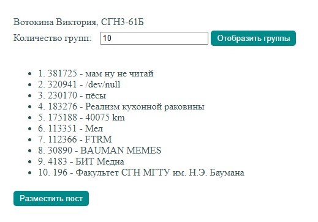

# Задание
Задание на эту лабораторную работу такое же, как и для предыдущей, однако
реализовать её нужно с помощью async/await. Необходимо создать HTML страницу с встроенным скриптом, который будет в зависимости от варианта выполнять следующие действия: Создать пост у себя на стене. Этот пост должен содержать названия и количество участников пяти групп, в которых вы состоите.

# Дополнительное задание 
Создать поле ввода. В поле ввода вводится число, которое ограничивает общее
количество аккаунтов, лайков, друзей, постов или групп, с которыми вам нужно
работать.
# Порядок выполнения работы
## Код файла html
```html
<!DOCTYPE html>
<html lang="en">
<head>
    <title>VK API Groups Async</title>
    <link href="./styles.css" rel="stylesheet" type="text/css">
    <script src="https://code.jquery.com/jquery-3.3.1.min.js"></script>
    <script src="index.js"></script>
</head>
<body>
    Вотокина Виктория, СГН3-61Б<br>
    Количество групп:
    <input type="text" id="amount-input">
    <button onclick="postGroups()">Разместить пост</button>
</body>

</html>
```

## Код файла js
```css
const ACCESS_TOKEN = "TOKEN";

async function postGroups() {
    const inputValue = document.getElementById('amount-input').value;
    const count = inputValue >= 1 ? inputValue : 5;

    const groupsResponse = await getMyGroups(count);
    const groups = sortGroupsByMemberAmont(groupsResponse.response.items);
    const postText = formatGroupsResponse(groups);
    const makePostResponse = await makePost(postText);
 
    alert('post_id: ' + makePostResponse.response.post_id);
}

async function getMyGroups(count) {
    return $.getJSON({
        url: 'https://api.vk.com/method/groups.get?access_token=' + ACCESS_TOKEN + '&v=5.131&filter=publics&extended=1&fields=members_count',
        jsonp: "callback",
        dataType: "jsonp"
    }).promise();
}

async function makePost(message) {
    return $.getJSON({
        url: "https://api.vk.com/method/wall.post?access_token=" + ACCESS_TOKEN + "&v=5.131&&message=" + message,
        jsonp: "callback",
        dataType: "jsonp"
    
    }).promise();
}

function formatGroupsResponse(data) {
    var groups = "";
    groups += data[0].name + " - " + data[0].members_count + "%0A";
    return groups;
}

function sortGroupsByMemberAmont(items) {

    items.sort(function(a, b) {
        var keyA = new Number(a.members_count),
            keyB = new Number(b.members_count);

        if (keyA > keyB) return -1;
        if (keyA < keyB) return 1;
        return 0;
    });

    console.log(items);
   
    return items;
}
```


## Скриншоты работающей программы
