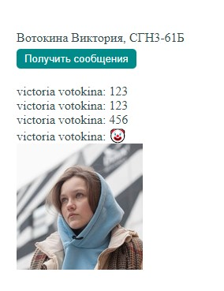

# Задание
Создать бота для Telegram. Отослать ему сообщение со своего аккаунта. С помощью API прочитать это сообщение. Создать HTML файл, который с помощью JavaScript по API прочитает это сообщение и выведет его на странице.

# Дополнительное задание 
Получить фотографию аккаунта пользователя, который отправил последнее
сообщение боту
# Порядок выполнения работы
## Код файла html
```html
<!DOCTYPE html>
<head>
    <title>TG Bot</title>
    <link href="./styles.css" rel="stylesheet" type="text/css">
    <script src="https://code.jquery.com/jquery-3.3.1.min.js"></script>
    <script src="index.js"></script>
</head>
<body>
    Вотокина Виктория, СГН3-61Б<br>
    <button onclick="getMessagesButtonClicked()">Получить сообщения</button>
    <div id="messages"></div>
    </div>
    <ul id="photos">

    </ul>
</body>
</html>
```

## Код файла js
```css
const telegramBotToken = 'TOKEN';

async function getMessagesButtonClicked() {

    const updates = await getTelegramUpdates();
    console.log(updates);

    const messages = updates.result.reduce(function (acc, next) {
        acc += next.message.from.first_name + " " + next.message.from.last_name  + ": " + next.message.text + "\n";
        return acc;
    }, "");

    const photoUrl = await getUserPhoto(updates.result[updates.result.length - 1].message.from.id)

    printMessages(messages);
    insertPhoto(photoUrl);
}

async function getTelegramUpdates() {
    return $.getJSON({
        url: "https://api.telegram.org/bot" + telegramBotToken + "/getUpdates",
        jsonp: "callback",
        dataType: "json"
    }).promise();
}

function printMessages(text) {
    const div = document.getElementById('messages');

    div.innerText = text;
}

function insertPhoto(url) {
    const img = document.getElementById('photo');
    img.src = url;
}


async function getUserPhoto(userId) {
    const photos = await $.getJSON({
        url: "https://api.telegram.org/bot" + telegramBotToken + "/getUserProfilePhotos?user_id=" + userId,
        jsonp: "callback",
        dataType: "json"
    }).promise();


    const fileId = photos.result.photos[1][0].file_id;

    const fileResponse = await $.getJSON({
        url: "https://api.telegram.org/bot" + telegramBotToken + "/getFile?file_id=" + fileId,
        jsonp: "callback",
        dataType: "json"
    }).promise();

    return "https://api.telegram.org/file/bot" + telegramBotToken + "/" + fileResponse.result.file_path;
}
```


## Скриншоты работающей программы
