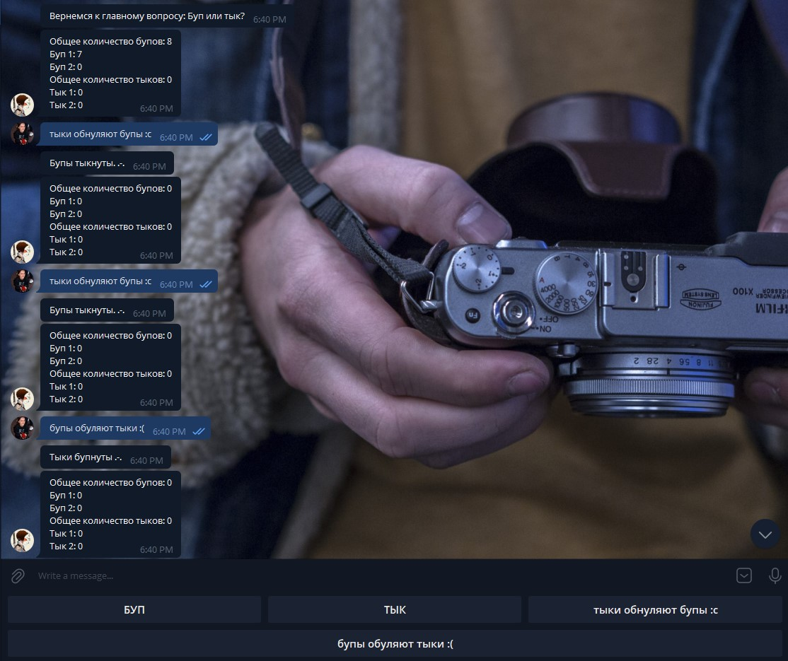

# Задание
Создать меню (клавиатуру) для вашего бота. Модифицируйте текст пунктов меню, не используйте примеры из теории ниже. На нажатие каждой клавиши должен выдаваться ответ, глубина вложенности вопросов и ответов должна быть не меньше двух, т.е. на первый ответ пользователя бот присылает новую клавиатуру с новыми вопросами. Всего различных клавиш должно быть не меньше восьми.

# Дополнительное задание 
Вывести счётчик нажатий каждой клавиши.
# Порядок выполнения работы
## Код файла *.py
```python
import telebot
from telebot import types

bot = telebot.TeleBot("TOKEN")

btnCounter = [0, 0, 0, 0, 0, 0]
BUTTONS = ['БУП', 'ТЫК',  'тыки обнуляют бупы :с',  'бупы обуляют тыки :(']
BUTTONS_BUP = ['буп 1', 'буп 2', 'назад']
BUTTONS_TIK = ['тык 1', 'тык 2', 'назад']

@bot.message_handler(commands=['start'])
def start(message):
    msg = bot.send_message(message.chat.id, 'Хэллоу!')
    keyboard = types.ReplyKeyboardMarkup(resize_keyboard=True)
    keyboard.add(*[types.KeyboardButton(name) for name in BUTTONS])
    msg = bot.send_message(message.chat.id, 'Буп или тык?', reply_markup=keyboard)

@bot.message_handler(content_types=["text"])
def reply_message(message):

    keyboard = types.ReplyKeyboardMarkup(resize_keyboard=True)

    if message.text == BUTTONS[0] :
        btnCounter[0] += 1
        keyboard.add(*[types.KeyboardButton(name) for name in BUTTONS_BUP])
        msg = bot.send_message(message.chat.id, 'Какой буп?', reply_markup=keyboard)

    elif message.text == BUTTONS[1] :
        btnCounter[1] += 1
        keyboard.add(*[types.KeyboardButton(name) for name in BUTTONS_TIK])
        msg = bot.send_message(message.chat.id, 'Какой тык?', reply_markup=keyboard)

    elif message.text == BUTTONS[2] :
        btnCounter[0] = 0
        btnCounter[2] = 0
        btnCounter[3] = 0
        keyboard.add(*[types.KeyboardButton(name) for name in BUTTONS])
        msg = bot.send_message(message.chat.id, 'Бупы тыкнуты. .-.', reply_markup=keyboard)
    
    elif message.text == BUTTONS[3] :
        btnCounter[1] = 0
        btnCounter[4] = 0
        btnCounter[5] = 0
        keyboard.add(*[types.KeyboardButton(name) for name in BUTTONS])
        msg = bot.send_message(message.chat.id, 'Тыки бупнуты .-.', reply_markup=keyboard)

    elif message.text == BUTTONS_BUP[0] :
        btnCounter[0] += 1
        btnCounter[2] += 1 # bup 1

    elif message.text == BUTTONS_BUP[1] :
        btnCounter[0] += 1
        btnCounter[3] += 1 # bup 2

    elif message.text == BUTTONS_TIK[0] :
        btnCounter[1] += 1
        btnCounter[4] += 1 # tik 1

    elif message.text == BUTTONS_TIK[1] :
        btnCounter[1] += 1
        btnCounter[5] += 1 # tik 2

    elif message.text == BUTTONS_BUP[2] :
        keyboard.add(*[types.KeyboardButton(name) for name in BUTTONS])
        msg = bot.send_message(message.chat.id, 'Вернемся к главному вопросу: Буп или тык?', reply_markup=keyboard)

    msg = bot.send_message(message.chat.id, "Общее количество бупов: " + str(btnCounter[0]) + 
    "\nБуп 1: " + str(btnCounter[2]) + "\nБуп 2: " + str(btnCounter[3]) + 
    "\nОбщее количество тыков: " + str(btnCounter[1]) + 
    "\nТык 1: " + str(btnCounter[4]) + "\nТык 2: " + str(btnCounter[5]))

def sendKeyboard(chatId, message, keyButtons):
    keyboard = types.ReplyKeyboardMarkup()


bot.polling(none_stop=True)

```

## Скриншоты работающей программы
